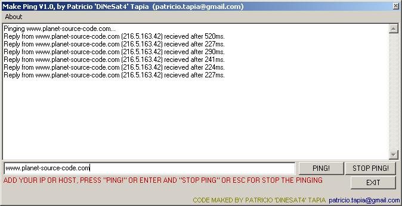



## A complete ping code using API Code and ICMP \! very easy

### Description

Is a API code that allows the application to make a PING to host, just as the command "ping" made in the CMD of Windows, which will respond suitably
 
### More Info
 
It allows to detect if host exists or not before making a connection TCP/UDP

             |
---                |---
**Submitted On**   |2005-01-30 00:26:02
**By**             |[DiNeSat4](https://github.com/Planet-Source-Code/PSCIndex/blob/master/ByAuthor/dinesat4.md)
**Level**          |Advanced
**User Rating**    |4.0 (8 globes from 2 users)
**Compatibility**  |VB 6\.0
**Category**       |[Windows API Call/ Explanation](https://github.com/Planet-Source-Code/PSCIndex/blob/master/ByCategory/windows-api-call-explanation__1-39.md)
**World**          |[Visual Basic](https://github.com/Planet-Source-Code/PSCIndex/blob/master/ByWorld/visual-basic.md)
**Archive File**   |[A\_complete1845441302005\.zip](https://github.com/Planet-Source-Code/dinesat4-a-complete-ping-code-using-api-code-and-icmp-very-easy__1-58557/archive/master.zip)

